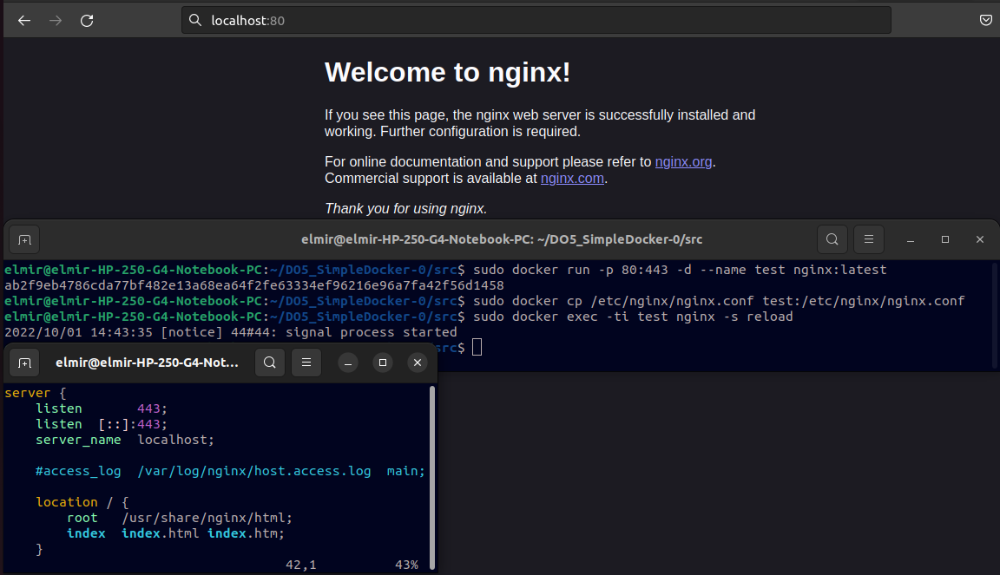
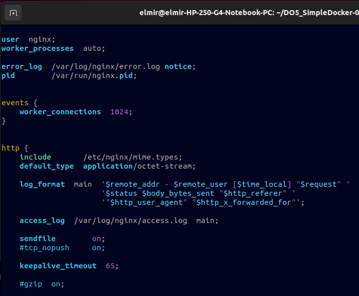

# Simple Docker

## Part 1. Готовый докер

**== Задание ==**

##### Взять официальный докер образ с **nginx** и выкачать его при помощи `docker pull`
*   
##### Проверить наличие докер образа через `docker images`
*   
##### Запустить докер образ через `docker run -d [image_id|repository]`
*   
##### Проверить, что образ запустился через `docker ps`
*   
##### Посмотреть информацию о контейнере через `docker inspect [container_id|container_name]`
*   
##### По выводу команды определить и поместить в отчёт размер контейнера, список замапленных портов и ip контейнера
* 
* 
*   
##### Остановить докер образ через `docker stop [container_id|container_name]` & Проверить, что образ остановился через `docker ps`
*   
##### Запустить докер с замапленными портами 80 и 443 на локальную машину через команду *run* & Проверить, что в браузере по адресу *localhost:80* доступна стартовая страница **nginx**
* Чтобы связка портов 80:443 сработала, необходимо изменить настройки конфигурационного файла /etc/nginx/nginx.conf, установив в нём прослушивание порта 443. Я создал собственный nginx.conf файл (показан в нижнем правом углу на скриншоте) и произвёл копирование с заменой /etc/nginx/nginx.conf в контейнере. После внесённых изменений, задание было выполнено, что видно по скриншоту ниже:  

*   
##### Перезапустить докер контейнер через `docker restart [container_id|container_name]` & Проверить любым способом, что контейнер запустился (я использовал команду `sudo docker events --filter event=restart --since=1m`)
*   

## Part 2. Операции с контейнером

**== Задание ==**

##### Прочитать конфигурационный файл *nginx.conf* внутри докер образа через команду *exec*
* Определим расположение файла конфигурации командой `sudo docker exec -ti a8942a28ec42 nginx -t`.  
Затем, прочитаем его `sudo docker exec -ti a8942a28ec42 cat /etc/nginx/nginx.conf`  

##### Создать на локальной машине файл *nginx.conf* & Настроить в нем по пути */status* отдачу страницы статуса сервера **nginx**
* 
* 
##### Скопировать созданный файл *nginx.conf* внутрь докер образа через команду `docker cp` & Перезапустить **nginx** внутри докер образа через команду *exec* & Проверить, что по адресу *localhost:80/status* отдается страничка со статусом сервера **nginx**
* 
* 
##### Экспортировать контейнер в файл *container.tar* через команду *export* & Остановить контейнер & Удалить образ через `docker rmi [image_id|repository]`, не удаляя перед этим контейнеры & Удалить остановленный контейнер
* 
##### Импортировать контейнер обратно через команду *import* & Запустить импортированный контейнер & Проверить, что по адресу *localhost:80/status* отдается страничка со статусом сервера **nginx**
* 
