## Part 1. Инструмент **ipcalc**
**== Задание ==**

##### Определить и записать в отчёт:
##### 1) Адрес сети *192.167.38.54/13:*
Запустив команду ipcalc 192.167.38.54/13, получим результат со значением адреса сети:
* 192.160.0.0
##### 2) Перевод маски *255.255.255.0* в префиксную и двоичную запись, */15* в обычную и двоичную, *11111111.11111111.11111111.11110000* в обычную и префиксную
* 255.255.255.0 = /24, 11111111.11111111.11111111.00000000
* /15 = 255.254.0.0, 11111111.11111110.00000000.00000000
* 11111111.11111111.11111111.11110000 = 255.255.255.240, /28
##### 3) Минимальный и максимальный хост в сети *12.167.38.4* при масках: */8*, *11111111.11111111.00000000.00000000*, *255.255.254.0* и */4*
* 12.167.38.4/8  
    => HostMin: 12.0.0.1 --- HostMax: 12.255.255.254
* 12.167.38.4/11111111.11111111.00000000.00000000(что равно префиксу /16)  
    => HostMin: 12.167.0.1 --- HostMax: 12.167.255.254
* 12.167.38.4/255.255.254.0(что равно префиксу /23)  
    => HostMin: 12.167.38.1 --- HostMax: 12.167.39.254
* 12.167.38.4/4  
    => HostMin: 0.0.0.1 --- HostMax: 15.255.255.254
#### 1.2. localhost
##### Определить и записать в отчёт, можно ли обратиться к приложению, работающему на localhost, со следующими IP: *194.34.23.100*, *127.0.0.2*, *127.1.0.1*, *128.0.0.1*
localhost (так называемый, «местный» от англ. local, или «локальный хост», по смыслу — этот компьютер) — в компьютерных сетях, стандартное, официально зарезервированное доменное имя для частных IP-адресов (в диапазоне 127.0.0.1 — 127.255.255.254, RFC 2606).
###### Поэтому можно обратиться к localhost, с IP: 
* 127.0.0.2
* 127.1.0.1
###### И нельзя обратиться с IP:
* 194.34.23.100
* 128.0.0.1
##### Поочерёдно пропингуем каждый адрес и посмотрим на результат:
* 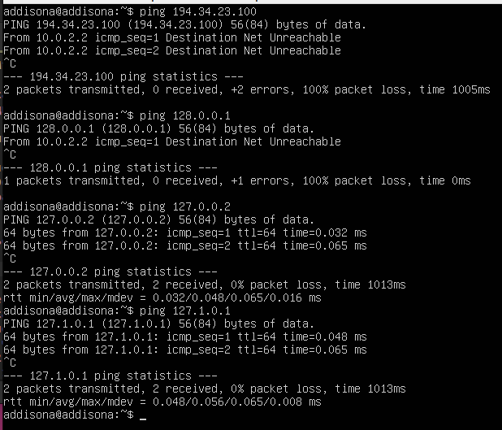
#### 1.3. Диапазоны и сегменты сетей
##### Определить и записать в отчёт:
##### 1) какие из перечисленных IP можно использовать в качестве публичного, а какие только в качестве частных: *10.0.0.45*, *134.43.0.2*, *192.168.4.2*, *172.20.250.4*, *172.0.2.1*, *192.172.0.1*, *172.68.0.2*, *172.16.255.255*, *10.10.10.10*, *192.169.168.1*
* Публичные: 134.43.0.2, 172.0.2.1, 192.172.0.1, 172.68.0.2, 192.169.168.1
* Частные: 10.0.0.45, 192.168.4.2, 172.20.250.4, 172.16.255.255, 10.10.10.10

##### 2) какие из перечисленных IP адресов шлюза возможны у сети *10.10.0.0/18*: *10.0.0.1*, *10.10.0.2*, *10.10.10.10*, *10.10.100.1*, *10.10.1.255*
* 10.10.0.2, 10.10.10.10

## Part 2. Статическая маршрутизация между двумя машинами

**== Задание ==**

##### Поднять две виртуальные машины (далее -- ws1 и ws2)

##### С помощью команды `ip a` посмотреть существующие сетевые интерфейсы:
* 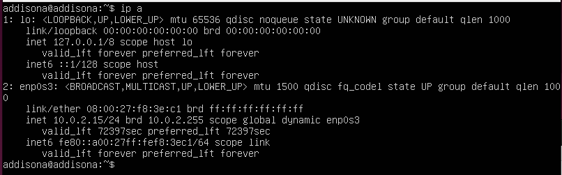
* 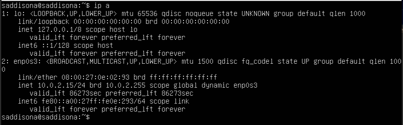
##### Описать сетевой интерфейс, соответствующий внутренней сети, на обеих машинах и задать следующие адреса и маски: ws1 - *192.168.100.10*, маска */16*, ws2 - *172.24.116.8*, маска */12*
* Внутренней сети, в обоих случаях, соответствуют сетевые интерфейсы под названием enp0s3.  
    Сетевой интерфейс — это физическое или виртуальное устройство, предназначенное для передачи данных между программами через компьютерную сеть.  
    Каждый интерфейс в сети может быть однозначно идентифицирован по его адресу. Разные сетевые протоколы используют разные системы адресации, например MAC-адреса в Ethernet или IP-адреса в IP.  
    Настройка сетевых интерфейсов в UNIX/Linux-системах традиционно выполняется с помощью команды ifconfig, а в Linux ещё и при помощи команды ip.  
    Сетевой интерфейс из первого скрина имеет MAC-адрес 08:00:27:f8:3e:c1 и ip4 адрес 10.0.2.15/24.  
    Сетевой интерфейс из второго скрина имеет MAC-адрес 08:00:27:0e:02:93 и ip4 адрес 10.0.2.15/24.  
    
* 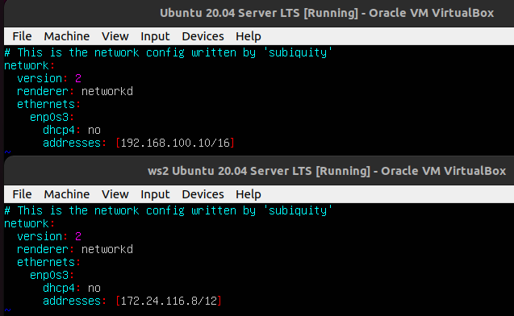
##### Выполнить команду `netplan apply` для перезапуска сервиса сети
* 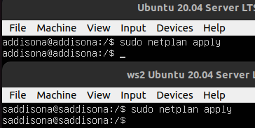

#### 2.1. Добавление статического маршрута вручную
##### Добавить статический маршрут от одной машины до другой и обратно при помощи команды вида `ip r add`
* 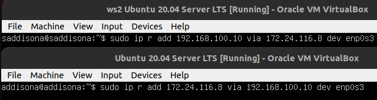
##### Пропинговать соединение между машинами
* 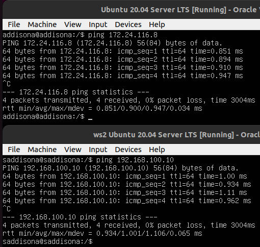

#### 2.2. Добавление статического маршрута с сохранением
##### Перезапустить машины
##### Добавить статический маршрут от одной машины до другой с помощью файла *etc/netplan/00-installer-config.yaml*
* 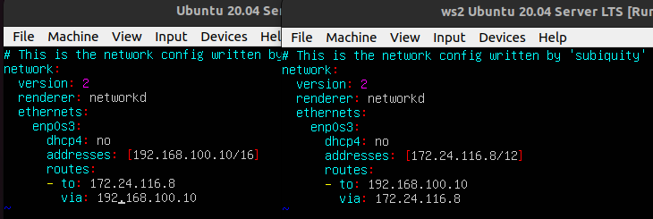
##### Пропинговать соединение между машинами (перед этим выполнить команду `netplan apply`)
* 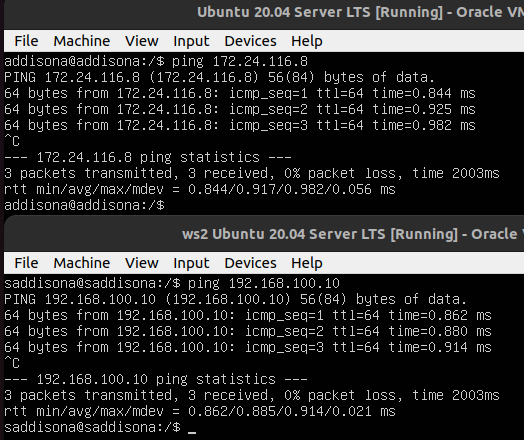

## Part 3. Утилита **iperf3**

#### 3.1. Скорость соединения
##### Перевести и записать в отчёт: 8 Mbps в MB/s, 100 MB/s в Kbps, 1 Gbps в Mbps

* 8 Mbps = 1 MB/s;
* 100 MB/s = 100000 Kbps;
* 1 Gbps = 1000 Mbps;

#### 3.2. Утилита **iperf3**
##### Измерить скорость соединения между ws1 и ws2
###### 1) Введём на ws1 команду iperf3 -s -B 192.168.100.10 и подключимся к созданному соединению с ws2 командой iperf3 -c 192.168.100.10

* Скорость соединения равна 1.47 Gbits/sec
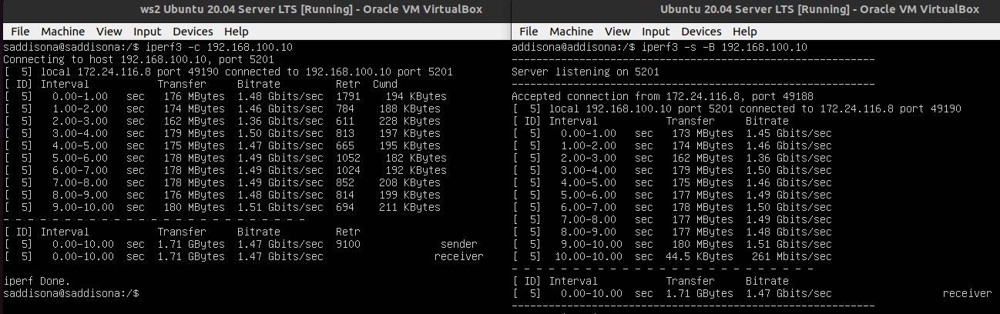

###### 2) Проделаем тоже самое наоборот: ws2 => iperf3 -s -B 172.24.116.8, ws1 => iperf3 -c 172.24.116.8

* Скорость соединения равна 1.44 Gbits/sec


## Part 4. Сетевой экран

**== Задание ==**

#### 4.1. Утилита **iptables**
##### Создать файл */etc/firewall.sh*, имитирующий фаерволл, на ws1 и ws2:

##### Нужно добавить в файл подряд следующие правила:
##### 1) на ws1 применить стратегию когда в начале пишется запрещающее правило, а в конце пишется разрешающее правило (это касается пунктов 4 и 5)
##### 2) на ws2 применить стратегию когда в начале пишется разрешающее правило, а в конце пишется запрещающее правило (это касается пунктов 4 и 5)
##### 3) открыть на машинах доступ для порта 22 (ssh) и порта 80 (http)
##### 4) запретить *echo reply* (машина не должна "пинговаться”, т.е. должна быть блокировка на OUTPUT)
##### 5) разрешить *echo reply* (машина должна "пинговаться")
* 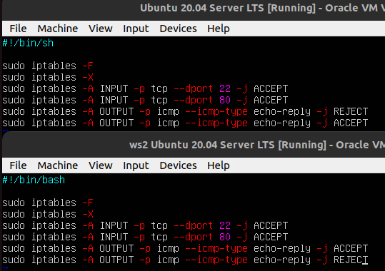
##### Запустить файлы на обеих машинах командами `chmod +x /etc/firewall.sh` и `/etc/firewall.sh`
* 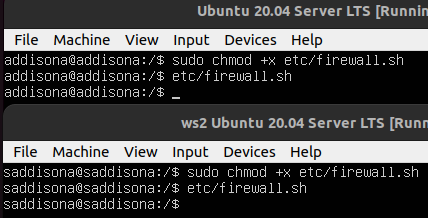
##### В отчёте описать разницу между стратегиями, применёнными в первом и втором файлах.
* Сообщения типа Echo (эхо) - принадлежат к парным сообщениям ICMP. Сообщения этого типа используются для того, чтобы определить возможность достижения и статус компонентов сети Internet. Любой компонент сети, который получает адресованное ему сообщение Echo Request, должен сформировать ответное сообщение Echo Reply в адрес источника полученного сообщения.   
Как было выше отмечено, сообщения Echo Request/Reply используются для того, чтобы проверить правильность функционирования сети, однако, эти же сообщения  могут быть использованы для того, чтобы нарушить функционирование сети. Для этого, чтобы нарушить функционирование сети в данном случае используется специальный тип спланированных действий, который называется атакой.  
Атака - это совокупность преднамеренных и координированных действий, которые предпринимаются группой злоумышленников и направлены на то, чтобы причинить моральный или экономический ущерб хозяевам какой–либо сети путем нарушения нормального режима доступа к её информационным ресурсам.
Наиболее часто в сети Internet применяются атаки, которые направлены на инициирование перегрузки каналов доступа к данной сети и её активных компонентов потоками служебных сообщений. Поскольку в этом случае клиенты не могут получить доступ к ресурсам сети, такой класс атак называется DOS – Denial of Service(подавление услуги).  
Наиболее простые утилиты Ping посылают одно сообщение Echo Request в адрес назначения и указывают на получение ответного сообщения Echo Reply.  
В момент начала атаки атакующий хост формирует поток фальсифицированных сообщений типа Echo Request. Сообщения Echo Request, которые составляют этот поток, должны быть сформированы следующим образом:  
    Адрес назначения – сетевой адрес типа directed broadcast для сети посредника.  
    Адрес источника - сетевой адрес жертвы.  
После того, как шлюз посредника получает сообщение, которое адресовано всем хостам подключенной к нему сети, он осуществляет непосредственную доставку данного сообщения, используя при этом broadcast–адрес канального уровня. Таким образом, сообщение Echo Request получают все хосты данной сети. В соответствии с правилами формирования сообщений протокола ICMP, каждый из этих хостов должен будет сформировать ответное сообщение Echo Reply и направить его в адрес предполагаемого источника сообщения. Число этих ответных сообщений будет соответствовать числу активных на данный момент элементов в сети посредника. В данном случае сеть посредника играет роль умножителя, который увеличивает мощность информационного потока, который направлен на жертву нападения.  
Одним из радикальных способов противодействия атакам вышеуказанного типа является запрещение трафика ICMP Echo Request/Reply на входных интерфейсах (что реализовано в фаерволе ws1 - машина не пингуется). Однако данная мера лишает многих пользователей возможности использования эффективных инструментов, которые широко используются для  определения статуса данного компонента сети – утилит ping, tracert и т.д.

#### 4.2. Утилита **nmap**
##### Командой **ping** найти машину, которая не "пингуется", после чего утилитой **nmap** показать, что хост машины запущен
* 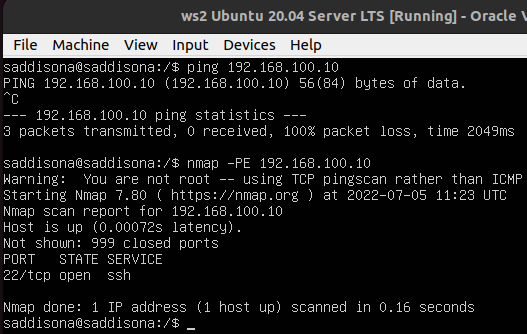

##### Сохранить дампы образов виртуальных машин
**p.s. Ни в коем случае не сохранять дампы в гит!**
* Создадим дамп образов виртуальных машин через терминал физического компьютера (на котором запущены виртуальные машины): vboxmanage debugvm "Ubuntu 20.04 Server LTS" dumpvmcore --filename f1.elf (дамп для ws1).

## Part 5. Статическая маршрутизация сети

**== Задание ==**

Сеть: \


##### Поднять пять виртуальных машин (3 рабочие станции (ws11, ws21, ws22) и 2 роутера (r1, r2))

#### 5.1. Настройка адресов машин
##### Настроить конфигурации машин в *etc/netplan/00-installer-config.yaml* согласно сети на рисунке.
* 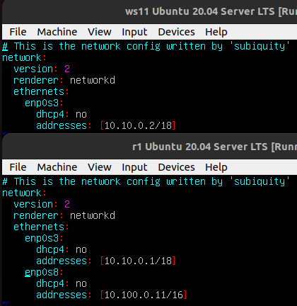
* 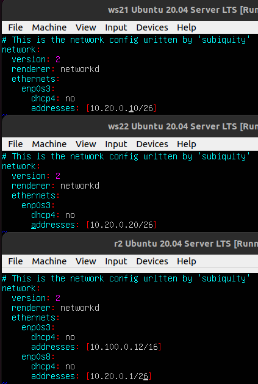
##### Перезапустить сервис сети. Если ошибок нет, то командой `ip -4 a` проверить, что адрес машины задан верно. Также пропинговать ws22 с ws21. Аналогично пропинговать r1 с ws11.
###### Перезапустим сервис сети каждой машины: systemctl restart systemd-networkd
* 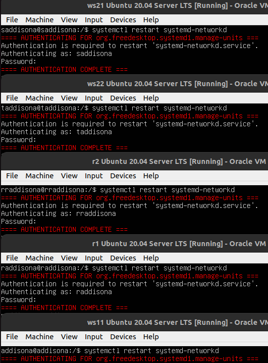
###### Проверим ip -4 a и пропингуем:
* 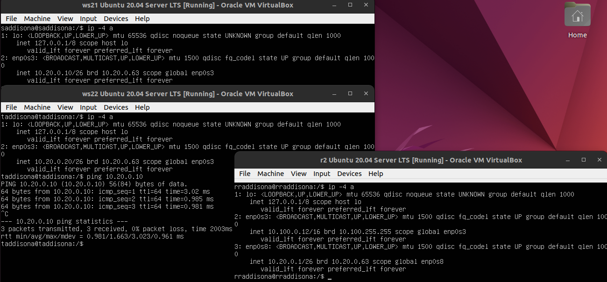
* 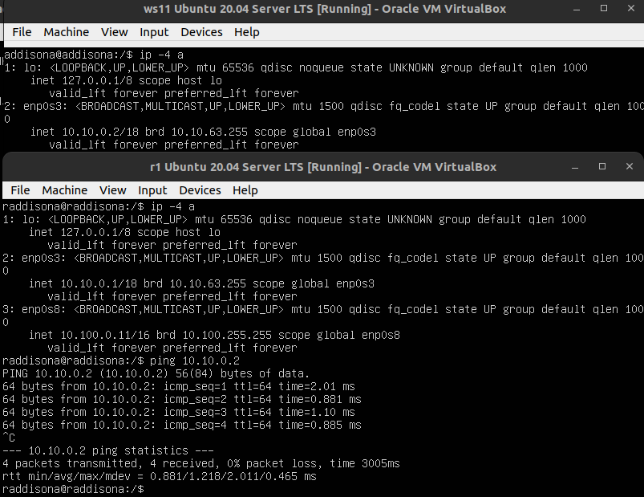

#### 5.2. Включение переадресации IP-адресов.
##### Для включения переадресации IP, выполните команду на роутерах:
`sysctl -w net.ipv4.ip_forward=1`
* 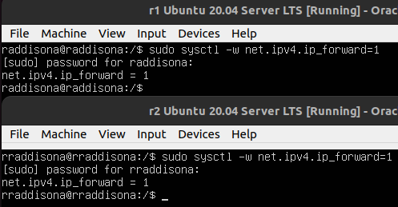
##### Откройте файл */etc/sysctl.conf* и добавьте в него следующую строку:
* 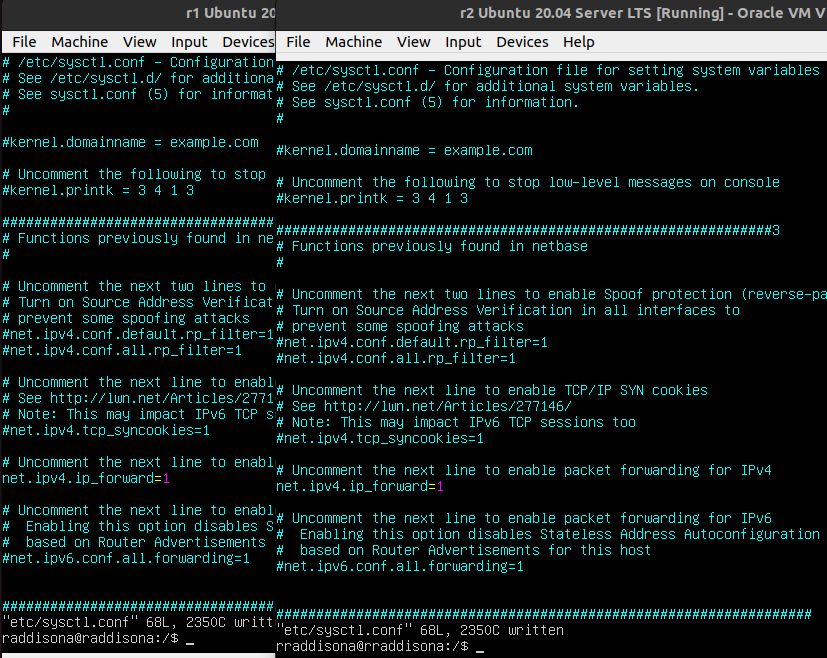

#### 5.3. Установка маршрута по-умолчанию

##### Настроить маршрут по-умолчанию (шлюз) для рабочих станций. Для этого добавить gateway4 \[ip роутера\] в файле конфигураций
* 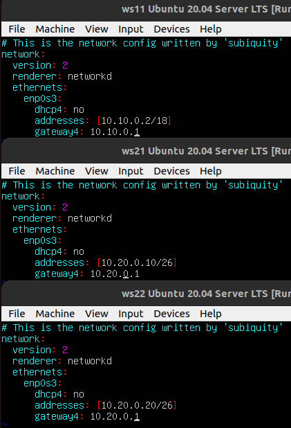
##### Вызвать `ip r` и показать, что добавился маршрут в таблицу маршрутизации
* 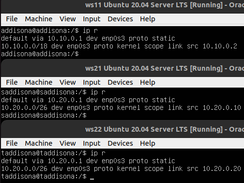
##### Пропинговать с ws11 роутер r2 и показать на r2, что пинг доходит. Для этого использовать команду:
`tcpdump -tn -i eth1`
* 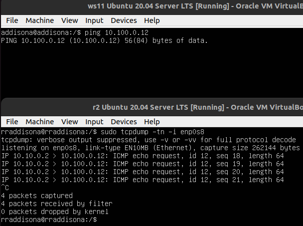

#### 5.4. Добавление статических маршрутов
##### Добавить в роутеры r1 и r2 статические маршруты в файле конфигураций. Пример для r1 маршрута в сетку 10.20.0.0/26:
```shell
# Добавить в конец описания сетевого интерфейса eth1:
- to: 10.20.0.0
  via: 10.100.0.12
```
* 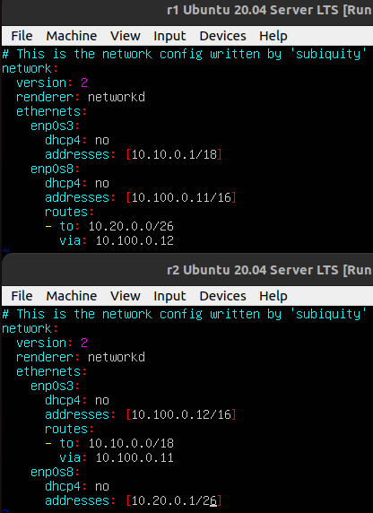
##### Вызвать `ip r` и показать таблицы с маршрутами на обоих роутерах. Пример таблицы на r1:
```
10.100.0.0/16 dev eth1 proto kernel scope link src 10.100.0.11
10.20.0.0/26 via 10.100.0.12 dev eth1
10.10.0.0/18 dev eth0 proto kernel scope link src 10.10.0.1
```
* 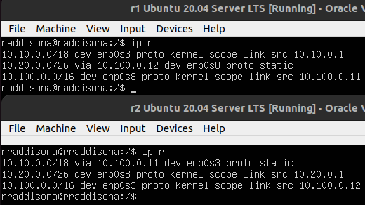

##### Запустить команды на ws11:
`ip r list 10.10.0.0/[маска сети]` и `ip r list 0.0.0.0/0`
* 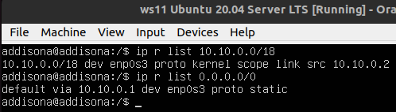
##### В отчёте объяснить, почему для адреса 10.10.0.0/\[порт сети\] был выбран маршрут, отличный от 0.0.0.0/0, хотя он попадает под маршрут по-умолчанию.
* В первом случае мы видим, что трафик на подсеть 10.10.0.0/18 уходит через интерфейс enp0s3. proto kernel означает, что роутинг был задан ядром автоматически при задании IP интерфейса. scope link означает, что эта запись является действительной только для этого интерфейса (enp0s3). src 10.10.0.2 задает IP-адрес отправителя для пакетов, попадающих под это правило роутинга. Т.е., учитывая сетевые настройки ws11, доступ в сеть 10.10.0.0/18 возможен напрямую, без посредника в виде r1.  
    Во втором случае трафик на любые другие хосты (а именно такую ситуацию мы подразумываем выполняя команду ip r list 0.0.0.0/0, где 0.0.0.0/0 означает "любой адрес / любая сеть") будет уходить на шлюз 10.10.0.1 (адрес роутера (r1)) через интерфейс enp0s3 (default via 10.10.0.1 dev enp0s3) и потом уже далее.

#### 5.5. Построение списка маршрутизаторов
Пример вывода утилиты **traceroute** после добавления шлюза:
```
1 10.10.0.1 0 ms 1 ms 0 ms
2 10.100.0.12 1 ms 0 ms 1 ms
3 10.20.0.10 12 ms 1 ms 3 ms
```
##### Запустить на r1 команду дампа: `tcpdump -tnv -i eth0`. И при помощи утилиты **traceroute** построить список маршрутизаторов на пути от ws11 до ws21:

* 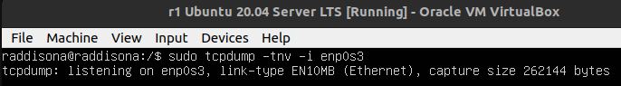
* 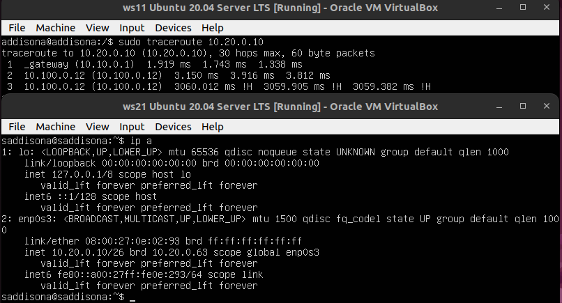
* 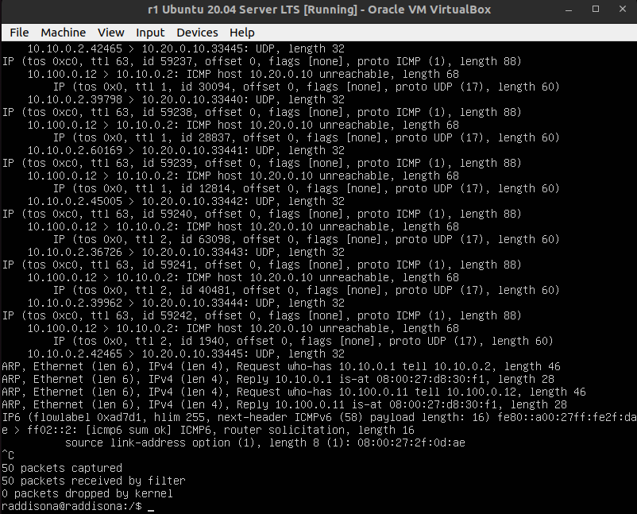

###### Объяснить принцип работы построения пути при помощи **traceroute**.
* traceroute — это служебная компьютерная программа, предназначенная для определения маршрутов следования данных в сетях TCP/IP. Traceroute основана на протоколе ICMP.  
Программа traceroute выполняет отправку данных указанному узлу сети, при этом отображая сведения о всех промежуточных маршрутизаторах, через которые прошли данные на пути к целевому узлу. В случае проблем при доставке данных до какого-либо узла программа позволяет определить, на каком именно участке сети возникли неполадки.  
Для определения промежуточных маршрутизаторов traceroute отправляет серию пакетов данных целевому узлу, при этом каждый раз увеличивая на 1 значение поля TTL («время жизни»). Это поле обычно указывает максимальное количество маршрутизаторов, которое может быть пройдено пакетом. Первый пакет отправляется с TTL, равным 1, и поэтому первый же маршрутизатор возвращает обратно сообщение ICMP, указывающее на невозможность доставки данных. Traceroute фиксирует адрес маршрутизатора, а также время между отправкой пакета и получением ответа (эти сведения выводятся на монитор компьютера). Затем traceroute повторяет отправку пакета, но уже с TTL, равным 2, что позволяет первому маршрутизатору пропустить пакет дальше.  
Процесс повторяется до тех пор, пока при определённом значении TTL пакет не достигнет целевого узла. При получении ответа от этого узла процесс трассировки считается завершённым.  
На оконечном хосте IP-дейтаграмма с TTL = 1 не отбрасывается и не вызывает ICMP-сообщения типа срок истёк, а должна быть отдана приложению. Достижение пункта назначения определяется следующим образом: отсылаемые traceroute дейтаграммы содержат UDP-пакет с таким номером UDP-порта адресата (превышающим 30000), что он заведомо не используется на адресуемом хосте. В пункте назначения UDP-модуль, получая подобные дейтаграммы, возвращает ICMP-сообщения об ошибке «порт недоступен». Таким образом, чтобы узнать о завершении работы, программе traceroute достаточно обнаружить, что поступило ICMP-сообщение об ошибке этого типа.

#### 5.6. Использование протокола **ICMP** при маршрутизации
##### Запустить на r1 перехват сетевого трафика, проходящего через eth0 с помощью команды `tcpdump -n -i eth0 icmp`. И пропинговать с ws11 несуществующий IP (например, *10.30.0.111*) с помощью команды: `ping -c 1 10.30.0.111`
* 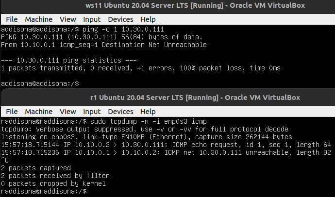

## Part 6. Динамическая настройка IP с помощью **DHCP**

**== Задание ==**

##### Для r2 настроить в файле */etc/dhcp/dhcpd.conf* конфигурацию службы **DHCP**:
##### 1) указать адрес маршрутизатора по-умолчанию, DNS-сервер и адрес внутренней сети (cначала нужно установить службу isc-dhcp-server: sudo apt-get install isc-dhcp-server). 
* 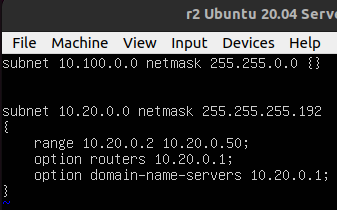

##### 2) в файле *etc/resolv.conf* прописать `nameserver 8.8.8.8.`
* 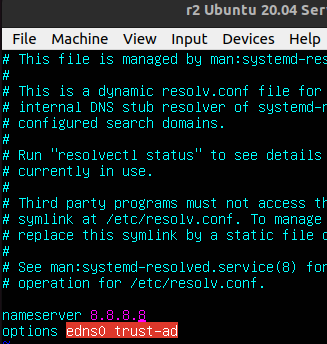

##### Внесём название необходимого сетевого интерфейса в файл etc/default/isc-dhcp-server на машине r2:
* 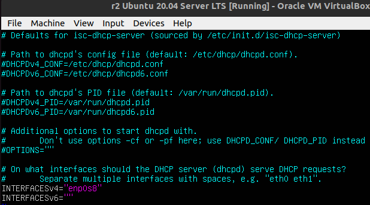

##### Перезагрузить службу **DHCP** командой `systemctl restart isc-dhcp-server` 
* 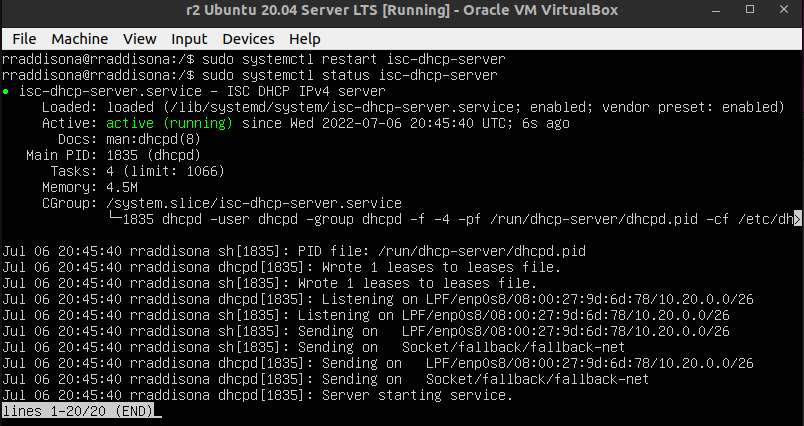

##### На машине ws21 в файле etc/netplan/00-installer-config.yaml включим dhcp4:
* 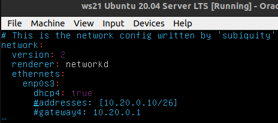

##### Машину ws21 перезагрузить при помощи `reboot` и через `ip a` показать, что она получила адрес. Также пропинговать ws22 с ws21.
* 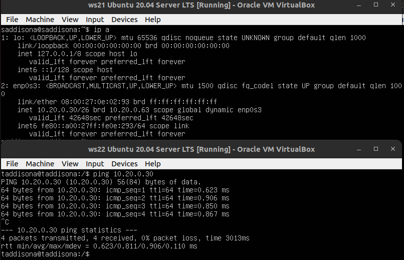

##### Указать MAC адрес у ws11, для этого в *etc/netplan/00-installer-config.yaml* надо добавить строки: `macaddress: 10:10:10:10:10:BA`, `dhcp4: true`
* 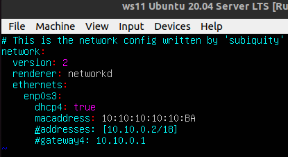

##### Для r1 настроить в файле */etc/dhcp/dhcpd.conf* конфигурацию службы **DHCP**:
##### r1 настроить аналогично r2, но сделать выдачу адресов с жесткой привязкой к MAC-адресу (ws11). Провести аналогичные тесты
##### 1) указать адрес маршрутизатора по-умолчанию, DNS-сервер и адрес внутренней сети (cначала нужно установить службу isc-dhcp-server: sudo apt-get install isc-dhcp-server).
* 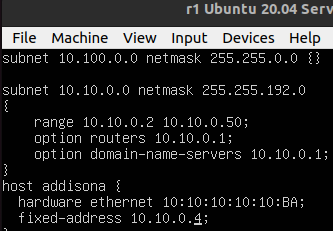

##### 2) в файле *etc/resolv.conf* прописать `nameserver 8.8.8.8.`
* 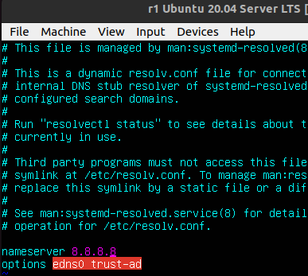

##### Внесём название необходимого сетевого интерфейса в файл etc/default/isc-dhcp-server на машине r1:
* 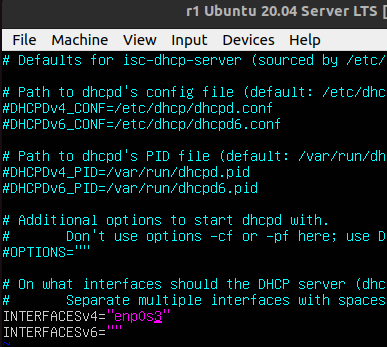

##### Перезагрузить службу **DHCP** командой `systemctl restart isc-dhcp-server` 
* 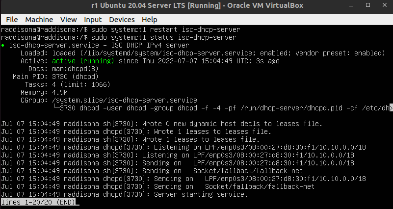

##### Пропингуем ws22 с ws11:
* 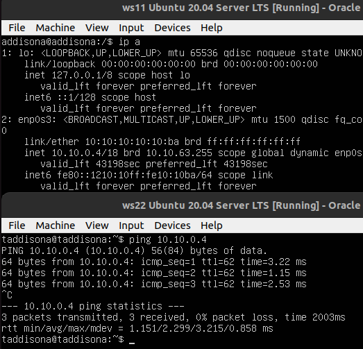

##### Запросить с ws21 обновление ip адреса
###### Сначала удалим существующий ip командой 'dhclient -r enp0s3', затем запросим у сервера новый ip командой 'dhclient enp0s3':
* 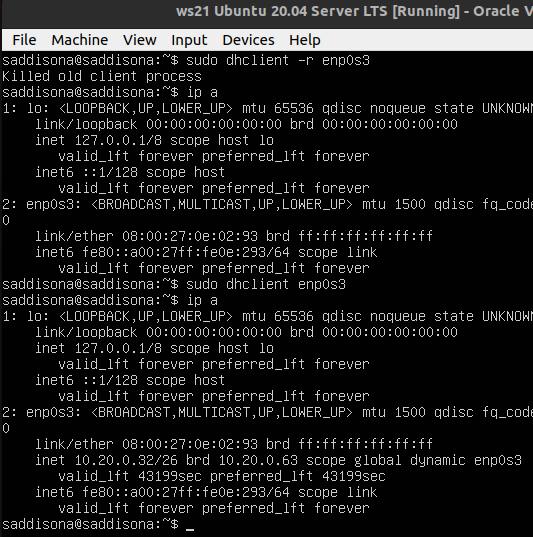

## Part 7. **NAT**

**== Задание ==**

##### В файле */etc/apache2/ports.conf* на ws22 и r1 изменить строку `Listen 80` на `Listen 0.0.0.0:80`, то есть сделать сервер Apache2 общедоступным
* 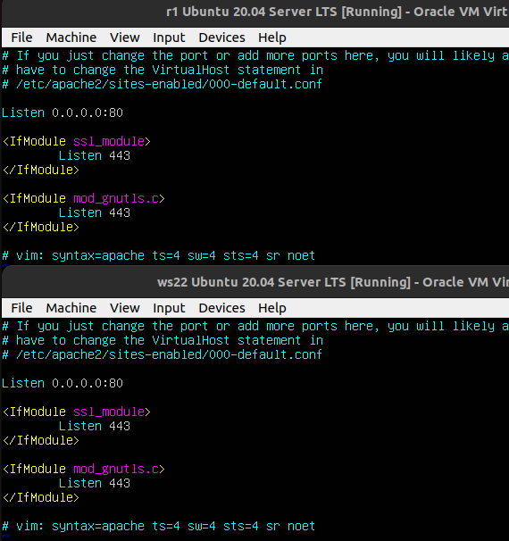
##### Запустить веб-сервер Apache командой `service apache2 start` на ws22 и r1
* 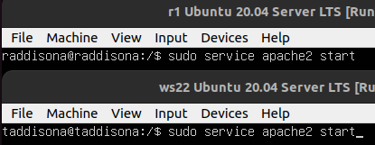
##### Добавить в фаервол, созданный по аналогии с фаерволом из Части 4, на r2 следующие правила:
##### 1) Удаление правил в таблице filter - `iptables -F`
##### 2) Удаление правил в таблице "NAT" - `iptables -F -t nat`
##### 3) Отбрасывать все маршрутизируемые пакеты - `iptables --policy FORWARD DROP`
##### Запускать файл также, как в Части 4
* 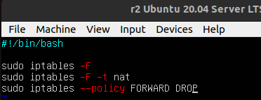
* 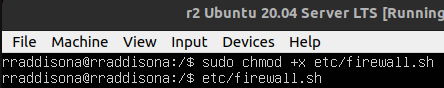
##### Проверить соединение между ws22 и r1 командой `ping`
*При запуске файла с этими правилами, ws22 не должна "пинговаться" с r1*
* 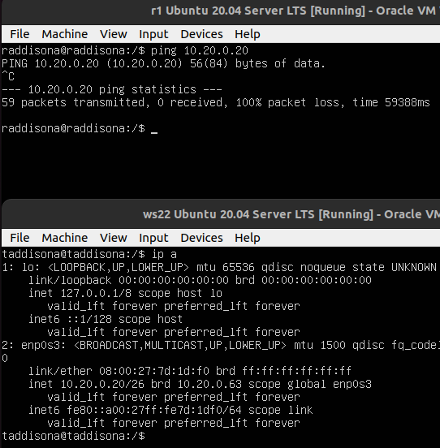

##### Добавить в файл ещё одно правило:
##### 4) Разрешить маршрутизацию всех пакетов протокола **ICMP**
* 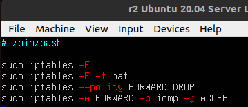

##### Запускать файл также, как в Части 4 (командами sudo chmod +x etc/firewall.sh и etc/firewall.sh)
##### Проверить соединение между ws22 и r1 командой `ping`
*При запуске файла с этими правилами, ws22 должна "пинговаться" с r1*
* 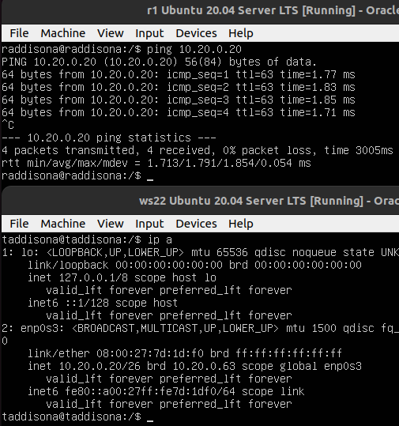

##### Добавить в файл ещё два правила:
##### 5) Включить **SNAT**, а именно маскирование всех локальных ip из локальной сети, находящейся за r2 (по обозначениям из Части 5 - сеть 10.20.0.0)
*Совет: стоит подумать о маршрутизации внутренних пакетов, а также внешних пакетов с установленным соединением*

##### 6) Включить **DNAT** на 8080 порт машины r2 и добавить к веб-серверу Apache, запущенному на ws22, доступ извне сети
*Совет: стоит учесть, что при попытке подключения возникнет новое tcp-соединение, предназначенное ws22 и 80 порту*
##### Запускать файл также, как в Части 4
##### Проверить соединение по TCP для **SNAT**, для этого с ws22 подключиться к серверу Apache на r1 командой. Также проверить соединение по TCP для **DNAT**, для этого с r1 подключиться к серверу Apache на ws22 командой `telnet` (обращаться по адресу r2 и порту 8080):
`telnet [адрес] [порт]`
* 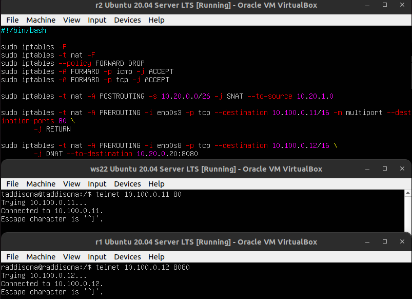
##### Для включения 8080 порта на сервере apache2 на ws22 закомментируем строку с 80 портом и добавим новую как показано на картинке ниже:
* 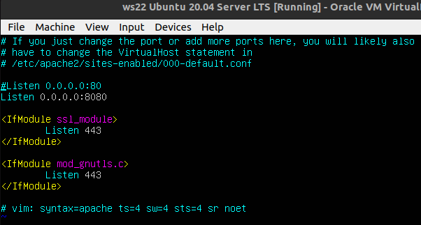

## Part 8. Дополнительно. Знакомство с **SSH Tunnels**

##### Запустить веб-сервер **Apache** на ws22 только на localhost (то есть не изменять файл */etc/apache2/ports.conf* или, если был изменен ранее, вернуть строку `Listen 80`)
##### Воспользоваться *Local TCP forwarding* с ws21 до ws22, чтобы получить доступ к веб-серверу на ws22 с ws21
##### Для проверки, сработало ли подключение в обоих предыдущих пунктах, перейдите во второй терминал (например, клавишами Alt + F2) и выполните команду:
`telnet 127.0.0.1 [локальный порт]`
* 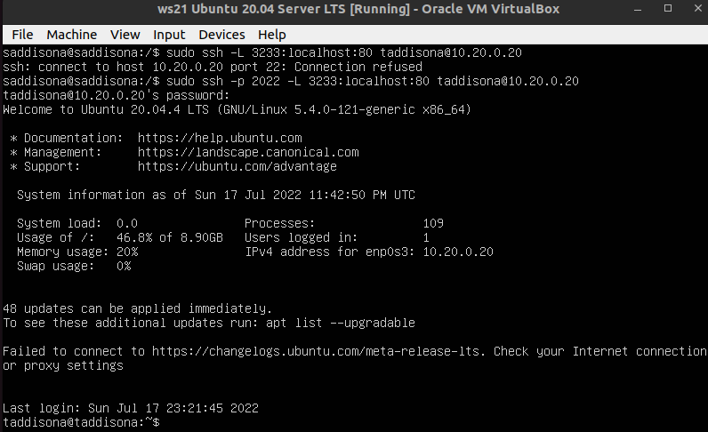
* 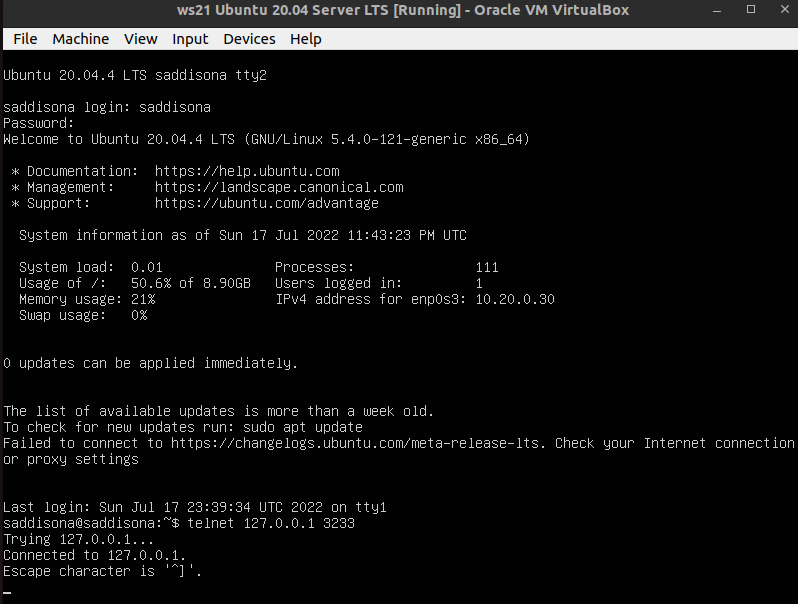


